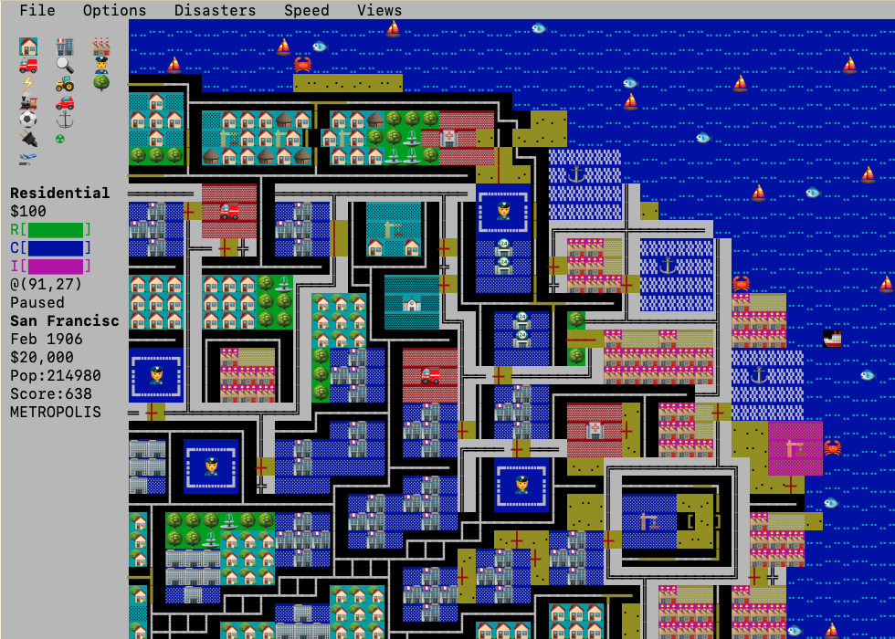

# ttycity — Micropolis (SimCity) for the terminal

A port of [Micropolis Activity](https://github.com/SimHacker/micropolis/tree/master/micropolis-activity) to the terminal using [ncurses](https://en.wikipedia.org/wiki/Ncurses). The original simulation engine is preserved as-is.



## Running

All assets (scenarios, cities) are baked into the binary — no external files needed.


```sh
./ttycity                       # new random city
./ttycity ../cities/bruce.cty   # load a city file
./ttycity -theme grass          # tan (default) | grass | dark
./ttycity -gfx color            # classic curses look, 8 colors (default)
./ttycity -gfx unicode          # emoji / unicode / UTF-8 graphics
./ttycity -gfx ascii            # 7-bit monochrome vt100
./ttycity -gfx aa               # aalib rendering (optional build)
```

Without `-gfx` the mode is auto-detected from `TERM`/locale.

## Playing

| keys | action |
|------|--------|
| arrows / `hjkl` | move the cursor |
| Shift + letter  | pick a tool (see palette) |
| Enter           | build at the cursor |
| `m`             | cycle overview map / overlays |
| `u`             | pick graphics mode |
| space           | pause · `0`–`3` set speed |
| Esc / F10       | menu bar |
| `g`             | new city · `q` quit |

Mouse supported: click to build, right-drag to pan, wheel scrolls; menus, palette and minimap are clickable. Resizable, works down to 80×24.

## Legal

Fork of Open Source Micropolis, based on SimCity Classic from Maxis, by Will Wright — https://github.com/SimHacker/micropolis/

- License: GPL (version 3 or later)
- Copyright (C) 1989 - 2007 Electronic Arts Inc.
